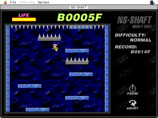

## Group members:
Ruihan Yin, Ziyu Tang, Caiwei Wang, Lien-Bee Huang.

# Project Overview

In this project, we will present a 2D solo-player platform game [ns-shaft](https://www.nagi-p.com/v1/eng/nsshaft.html), where players can move the character with arrow keys and dive deep into the cave. The goal is to dive deeper and get higher score, and character will die if it falls all the way to the bottom or run out of the "life". "Life" will decrease when character touches the pillards, but "life" can be recovered when landing on normal floors. "Life" information will be displayed on the top-left of the screen.

# Key Features

We plan to establish a basic version with fixed difficulty. And the task breakdown is as followed.

## Basic game logic

This part includes:

1. **Generating floors**: floors will be generated randomly with reasonable gaps.
2.  **Character control logic**: the movement of character will be controlled by the keyboard inputs, arrow key in specific. And the allowed movements are: left- and right-move. (Details to be determined).
3.  **"Life" control**: Decreases when hitting on pillards and increase when hitting on normal platform.
4.  **Speed control**: in the basic version, we intend to implement a simple logic on speed control that the speed will gradually increase along the depth and finally reach the pre-defined maximum and then remain constant.
>Note: Speed here refers to the moving-down speed of the camera.

## User Interface

we will build a single-layer interface with major game scene and necessary buttons, e.g. start/re-start, exit, etc..

# Timeline
1. 10/26 Teams registration
2. 11/09 Proposal
3. 11/23 Updates
4. 12/07 Demonstration
   

# Reference

[Brick](https://github.com/jtdaugherty/brick)

[NS-SHAFT](https://www.nagi-p.com/v1/eng/nsshaft.html)

[CSE230 Project Guideline](https://ucsd-cse230-np.github.io/web/project.html)

